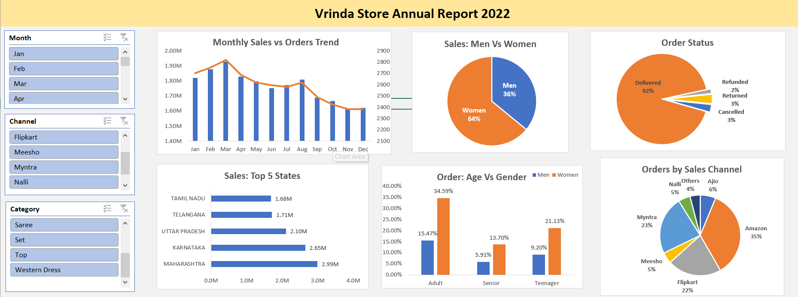

# Vrinda Store Sales Analysis Dashboard

This project analyzes Vrinda Store e-commerce sales data using Microsoft Excel.

## Tools Used
- Microsoft Excel
- Pivot Tables
- Pivot Charts
- Slicers
- Data Cleaning

## Key Insights
- Monthly sales vs order trends
- Sales comparison between men and women
- Top 5 states contributing to sales
- Order status analysis (Delivered, Cancelled, Returned)
- Sales distribution across different channels

## Dashboard Preview

